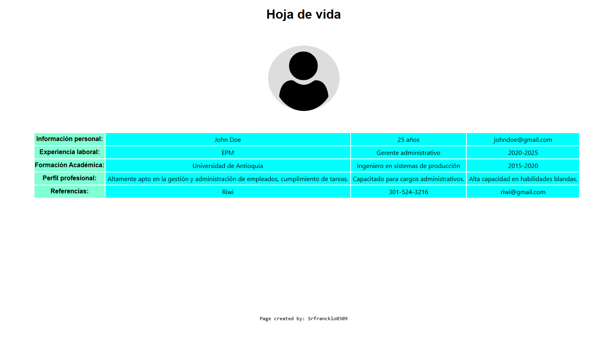
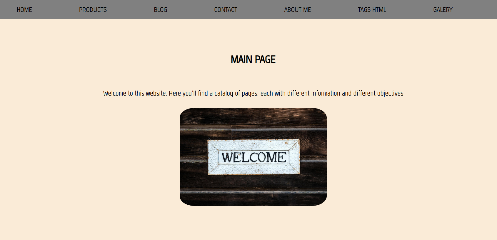
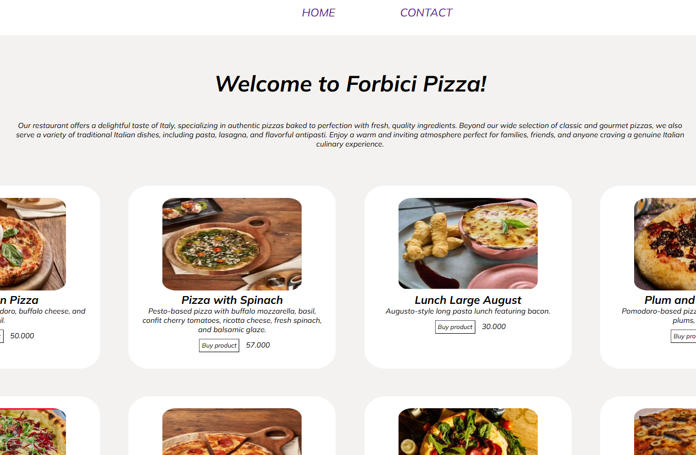

**Página Web Personal**

    ***Información que encontrarás***
        1.Breve descripción acerca de lo que le gusta a el desarrollador Emmanuel, virtudes y cualidades varias.
        2.Proyectos realizados por Emmanuel.
        3.Medios por los cuales contactar a el desarrollador Emmanuel.

**En todas las secciones habrá un barra de navegación en la parte superior donde el usuario podrá ingresar a la que desee**

*Sección #1 (Home)*

    --En la primera sección encontrarás una breve bienvenida con cualidades que más destacan en Emmanuel--

*Sección #2 (About Me)*

    --En esta sección encontrarás una descripción elegida por Emmanuel y una foto de perfil del mismo--

*Sección #3 (Projects)*

    --En la sección de "projects" hay 4 proyectos realizados por Emmanuel, los cuales si los clickeas te mostrará en una pestaña aparte el proyecto--

*Sección #4 (Contact)*

    --En esta última sección habrán 3 iconos de diferentes redes y medios sociales por los que se puede contactar a Emmanuel--

***Imágenes y Recursos usados**

*Imágenes*
    
    
    
    
    
    
    
    
    

*Recursos*
    [text](./imagenes-fuentes/hua-13.ttf)

**Maquetado de la página**

En este link encontrarás el maquetado de la página web, este fue hecho en canva:

---   https://www.canva.com/design/DAGp5mrlvlk/OJp4BalMfD0dHbmBUF2dLw/edit?utm_content=DAGp5mrlvlk&utm_campaign=designshare&utm_medium=link2&utm_source=sharebutton  ---

**Repositorio en Github**

En este link podrás ingresar al repositorio creado para esta página web en Github:

---   https://github.com/srfrancklo0309/modulo-2-prueba.git  ---

**Link de la página:-- https://srfrancklo0309.github.io/modulo-2-prueba/index.html --**